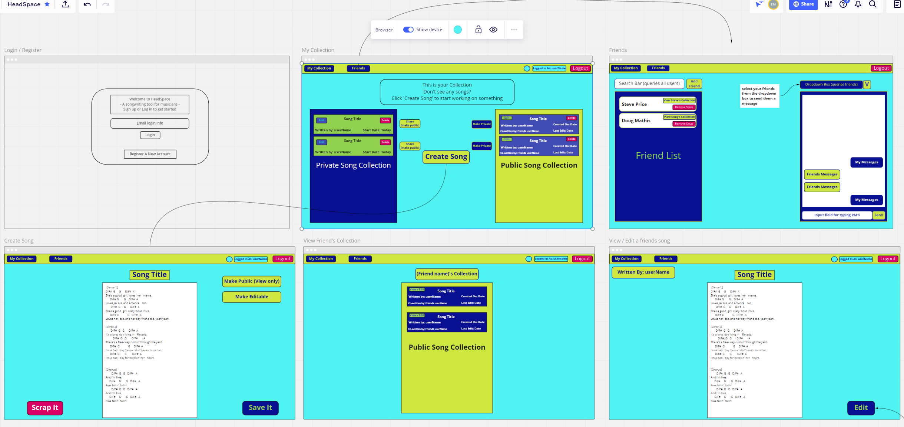

# HeadSpace

HeadSpace is an app designed to help musicians & songwriters do what they love most. It is an environment for you to take all your song ideas, lyrics & chord structures and store them in one easily accessable hub. You can create, view, edit and remove songs from your personal collection. If you want to collaborate on a song with a friend, or group of friends, this app enables multiple users to have edit rights to any single song. If multiple users are working on a song together, theres even a message board for you to communicate with your co-writers and share your ideas with each other. Once you log in, there are 2 main columns on the home page. You have your personal collection on the left, called My Collection, consisting of all the songs that you have created. On the right, is a social hub of sorts where you can add friends and view their collections or even edit one of their songs, assuming you have edit rights. When you click on 'Create Song' you will be presented with a blank monospaced text document and a 'Title' field. This allows you to just write down lyrics, guitar tab and create fully-funtional & useable chord charts or any combination of the three. Every musician has a different process for writing music so the idea is to give the user the option to write however they choose to and in whatever context or format they choose to. File uploads are also supported (only supports .mp3 & .wav file types) via Google Firebase Storage and there is an embedded music player to allow musicians record themselves playing or singing a song to assist with the collaboration process. 

### My Collection

This is the place where all of your creations will be stored. from here you can:
* Create new songs and save them to My Collection
* View, Edit or Delete songs you have already stored

### Friends

This is where you will be able to interact with other users on HeadSpace. features include:
* A friend list that allows you to add/remove friends as well as view any of their song collections
* A private messaging feature is available for you and your friends to collaborate on song ideas

## Technologies 
* HTML
* CSS
* Javascript
* ReactJS
* Bootstrap
* Firebase
* JSON Server

## How to use this app

In your terminal, navigate to the directory you wish to create the app in and type:

### `git clone git@github.com:EthanMathis/headspace.git`

Once you've cloned it down, cd into that directory and install the additional dependancies by running:

### `npm install`

This project will also use a JSON database running on port 8088. cd into headspace/api and run:

### `json-server -p 8088 -w database.json`

Once everything is installed and you have json server running, cd to the source directory and run:

### `npm start`

## Wireframe and ERD

